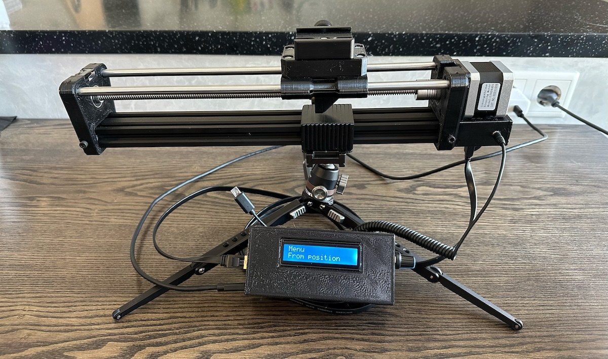
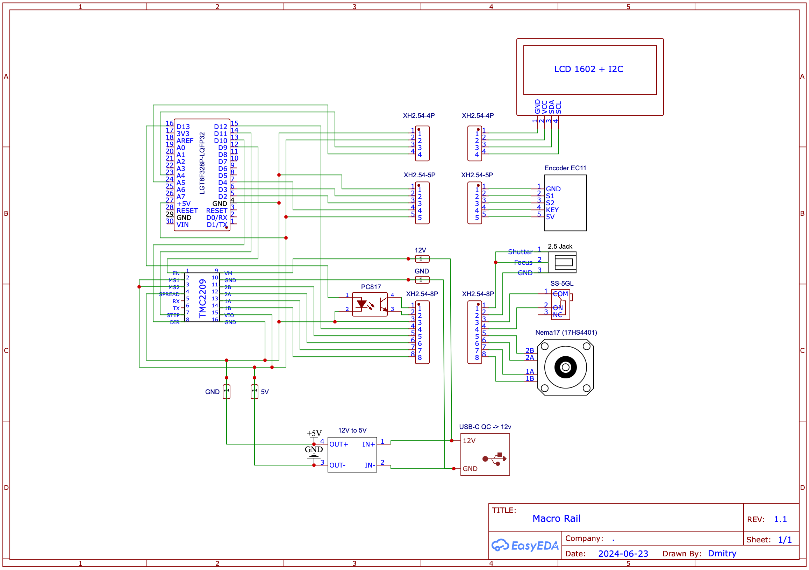

# Macro Slider | Слайдер для макросъемки

- [Macro Slider | Слайдер для макросъемки](#macro-slider--слайдер-для-макросъемки)
- [RU](#ru)
  - [Структура](#структура)
  - [Компоненты](#компоненты)
    - [Пульт](#пульт)
    - [Рельса](#рельса)
    - [Крепление](#крепление)
  - [Схема](#схема)
  - [Arduino](#arduino)
    - [Зависимости](#зависимости)
    - [Настройка](#настройка)
- [EN](#en)
  - [File Structure](#file-structure)
  - [Bill Of Materials (BOM)](#bill-of-materials-bom)
    - [Remote](#remote)
    - [Rail](#rail)
    - [Mounting](#mounting)
  - [Schematic](#schematic)
  - [Arduino](#arduino-1)
    - [Dependencies](#dependencies)
    - [Settings](#settings)

# RU

## Структура

arduino/macro_rail - [скетч для Arduino](/Arduino/macro_rail/)  
stl - [детали для 3D-печати](/STL/)  
pcb - [схема и плата](/PCB/)  

## Компоненты 

### Пульт

- [Печатная плата](/PCB/macro_rail_pcb.pdf) - 1шт
- Arduino nano (LGT8F328P-LQFP32) - 1шт
- Шаговый мотор Nema17 (17HS4401) - 1шт
- Драйвер шагового двигателя TMC2209 - 1шт
- Энкодер с кнопкой EC11 - 1шт
- Экран LCD1602C с i2c-интерфейсом - 1шт
- Оптопара транзисторная PC817 - 1шт
- Концевик SS-5GL - 1шт
- Понижающий преобразователь с 12В до 5В - 1шт
- Type-C QC 12В - 1шт
- XH2.54-4P male порт, female кабель - 1шт
- XH2.54-5P male порт, female кабель - 1шт
- XH2.54-8P male порт, female кабель - 1шт
- PH2.0-6P female кабель -1шт
- RJ45 порт - 2шт
- Audio female 2.5mm Jack PJ201M - 1шт

### Рельса

- Вал направляющий 8 мм длина 300мм - 1шт
- Линейный подшипник LM8UU с внутренним диаметром 8 мм - 4шт
- Трапецеидальный винт Т8 (Tr8x2) (Длина винта 300 мм, Шаг винта 2 мм. Однозаходный) - 1шт
- Латунная гайка для винта Tr.8x2 (Однозаходная) - 1шт
- Подшипник KP08 опорный фланцевый (8мм) - 1шт
- Муфта эластичная с отверстиями 5мм/8мм и резьбовым зажимом (CR 5x8 мм) - 1шт
- Профиль конструкционный V20х40SH 20x40 мм, паз 6 мм длина 300 мм - 1шт
- Заглушка торцевая 20x40 для профиля 2040 - 1шт
- Заглушка пазовая под паз 6 мм для профиля 2040 - 1шт
- Сухарь пазовый М4, паз 6 - 5шт
- Болт 1/4 длина 3/4 (для крепления площадки) - 1шт
- Arca Swiss Quick Release Plate - 1шт
- 2.5mm Remote Shutter Release Cable - 1шт
- Ethernet кабель (тестировался кабель до 2м) - 1шт

### Крепление

- M3 болт 6мм - 10шт
- M3 болт 10мм - 16шт
- М3 болт 16мм - 2шт
- M4 болт 14мм - 5шт
- M4 болт 30мм - 4шт
- М3 гайка - 2шт
- М4 гайка - 9шт
- М4 шайба - 8шт
- M6 шайба - 1шт

## Схема

## Arduino

### Зависимости

Чтобы скетч собрался сначала нужно установить библиотеки в Arduino IDE

В Arduino IDE в Library Manager нужно установить:  

- ArduinoSTL
- EncButton
- LiquidCrystal I2C
- TimeOne

### Настройка

Трапецеидальный винт Т8 может быть с любым шагом, но его шаг должен быть изменен в скетче  

файл Globals.cpp  
StepperT<STEPP_ENA, STEPP_STEP, STEPP_DIR, STEPP_END, 16, 200, **8**> g_stepper;  

файл Globals.h  
extern StepperT<STEPP_ENA, STEPP_STEP, STEPP_DIR, STEPP_END, 16, 200, **8**> g_stepper;  

# EN

## File Structure

arduino/macro_rail - [arduino sketch](/Arduino/macro_rail)  
stl - [3D-printable parts](/STL/)  
pcb - [schematic and PCB layout](/PCB/)  

## Bill Of Materials (BOM)

### Remote

- PCB - 1 pc
- Arduino nano (LGT8F328P-LQFP32) - 1 pcs
- Nema17 Stepper Motor (17HS4401) - 1 pcs
- TMC2209 Stepper Driver - 1 pcs
- EC11 Encoder with Button - 1 pcs
- LCD1602C Screen with i2c interface - 1 pcs
- PC817 Transistor Optocoupler - 1 pcs
- SS-5GL Limit Switch - 1 pcs
- 12V to 5V Step-Down Converter - 1 pcs
- Type-C QC 12V - 1 pcs
- XH2.54-4P male port, female cable - 1 pcs
- XH2.54-5P male port, female cable - 1 pcs
- XH2.54-8P male port, female cable - 1 pcs
- PH2.0-6P Female cable - 1 pcs
- RJ45 port - 2 pcs
- 2.5mm Audio Female Jack PJ201M - 1 pcs

### Rail

- 8mm Guide Rod, 300mm length - 1 pcs
- LM8UU Linear Bearing with 8mm inner diameter - 4 pcs
- Trapezoidal Screw T8 (Tr8x2) (Screw length 300mm, thread pitch 2mm, single-start) - 1 pcs
- Brass Nut for Tr8x2 Screw (single-start) - 1 pcs
- KP08 Flanged Bearing (8mm) - 1 pcs
- Elastic Coupling with 5mm/8mm holes and threaded clamp (CR 5x8mm) - 1 pcs
- V20x40SH Construction Profile, 20x40mm, 6mm slot, 300mm length - 1pcs
- End Cap for 20x40 profile - 1 pcs
- Slot Cap for 6mm slot profile 2040 - 1 pcs
- M4 Slot Nut, 6mm slot - 5 pcs
- 1/4” Bolt, 3/4” length (for platform mounting) - 1 pcs
- Arca Swiss Quick Release Plate - 1 pcs 
- 2.5mm Remote Shutter Release Cable - 1 pcs
- Ethernet Cable (tested with cable up to 2m) - 1 pcs

### Mounting

- M3 Screw 6mm - 10 pcs
- M3 Screw 10mm - 16 pcs
- M3 Screw 16mm - 2 pcs
- M4 Screw 14mm - 5 pcs
- M4 Screw 30mm - 4 pcs
- M3 Nuts - 2 pcs
- M4 Nuts - 9 pcs
- M4 Washers - 8 pcs
- M6 Washer - 1 pcs

## Schematic

## Arduino

### Dependencies

To compile the sketch, first install the necessary libraries in the Arduino IDE.  

In Arduino IDE, install the following through the Library Manager:  

- ArduinoSTL
- EncButton
- LiquidCrystal I2C
- TimeOne

### Settings

You can use a T8 trapezoidal screw with any thread pitch, but you will need to adjust the setting in the sketch..  

In the Globals.cpp file:  

StepperT<STEPP_ENA, STEPP_STEP, STEPP_DIR, STEPP_END, 16, 200, **8**> g_stepper;  

In the Globals.h file:  

extern StepperT<STEPP_ENA, STEPP_STEP, STEPP_DIR, STEPP_END, 16, 200, **8**> g_stepper;  